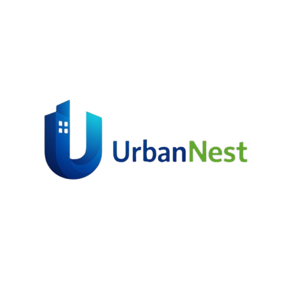

#  UrbanNEST - Frontend


Ethiopia's premier property marketplace frontend application. Find, list, and manage properties with ease.

## 📋 Table of Contents
- [Overview](#overview)
- [Features](#features)
- [Tech Stack](#tech-stack)
- [Getting Started](#getting-started)
- [Project Structure](#project-structure)
- [Environment Variables](#environment-variables)
- [Security Features](#security-features)
- [Available Scripts](#available-scripts)
- [Deployment](#deployment)
- [Contributing](#contributing)
- [License](#license)

## 🎯 Overview

UrbanNEST is a modern real estate platform connecting property seekers with agents and property owners in Ethiopia. This frontend application provides a seamless user experience for browsing properties, managing listings, and connecting with real estate professionals.

## ✨ Features

### 🔐 Authentication & Security
- Secure JWT-based authentication
- Protected routes with role-based access
- Password strength validation
- Rate limiting on auth attempts
- XSS protection with input sanitization
- SessionStorage token storage (more secure than localStorage)

### 🏠 Property Management
- Browse properties with advanced filters
- Detailed property views with images and specifications
- Create and manage property listings
- Favorite/save properties
- Property boosts for increased visibility

### 👤 User Features
- User profiles and settings
- Dashboard with property statistics
- Saved favorites management
- Email verification
- Password recovery

### 🎨 UI/UX
- Responsive design for all devices
- Dark/Light theme support
- Smooth animations with Framer Motion
- Toast notifications for user feedback
- Loading skeletons for better UX
- Accessibility compliant

### 📱 Performance
- Lazy loading for routes
- Code splitting for optimal bundle size
- Optimized asset loading
- Preconnect to external resources

## 🛠 Tech Stack

|   Technology      |       Description |
|-------------------|-------------|
| **React 18**      |     UI library with hooks and functional components |
| **TypeScript**    |     Type-safe JavaScript |
| **Vite**          |     Next-generation build tool |
| **Tailwind CSS**  |     Utility-first CSS framework |
| **React Router v6** |   Client-side routing |
| **Axios**           |  HTTP client with interceptors |
| **Framer Motion**   |   Animation library |
| **Lucide React**    |   Beautiful icon set |
| **Sonner**          |   Toast notifications |
| **DOMPurify**       |   XSS sanitization |

## 🚀 Getting Started

### Prerequisites
- Node.js 18+ 
- npm or yarn package manager

### Installation

1. **Clone the repository**
```bash
git clone https://github.com/yourusername/urbannest-client.git
cd urbannest-client
